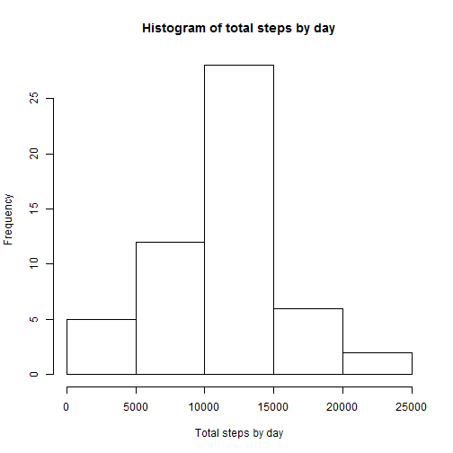
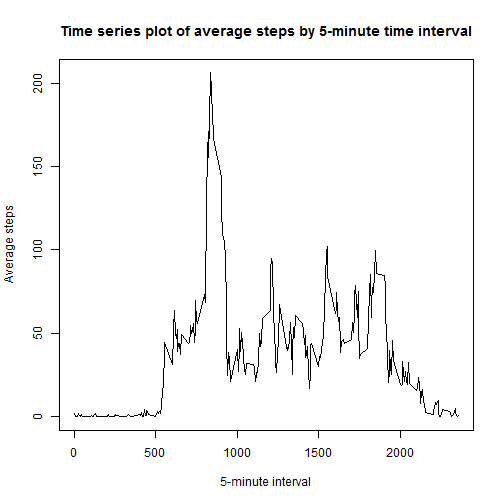
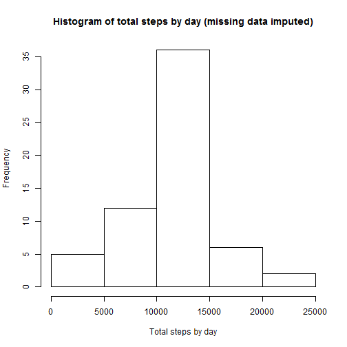
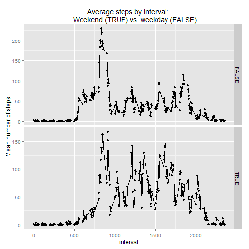

## Code produced to run through peer review assignment 1
##### Written by Dan Kellett
##### 10/03/2015


```r
setwd("C:/Users/Dan & Rach/Desktop/Data Science/Reproducible Research")
```

## Loading and preprocessing the data

##### Load the data (i.e. read.csv())
##### Data loaded into data frame 'rawData' by unzipping the file directly from GitHub

```r
rawData <- read.table(unz("C:/Users/Dan & Rach/Documents/GitHub/RepData_PeerAssessment1/activity.zip"
                          ,"activity.csv"), sep = ",", header = TRUE)
```

##### Process/transform the data (if necessary) into a format suitable for your analysis
##### Convert the 'date' field into a date format

```r
rawData$date <- as.Date(rawData$date, "%Y-%m-%d")
```

## What is mean total number of steps taken per day?
##### For this part of the assignment, you can ignore the missing values in the dataset.

##### Calculate the total number of steps taken per day
##### Use the doBy package to sum steps data by date - put results into data frame 'stepsSum'

```r
library(doBy)
```

```
## Warning: package 'doBy' was built under R version 3.1.2
```

```
## Loading required package: survival
## Loading required package: splines
```

```r
stepsSum <- summaryBy(steps ~ date, data=rawData, FUN=c(sum))
stepsSum
```

```
##          date steps.sum
## 1  2012-10-01        NA
## 2  2012-10-02       126
## 3  2012-10-03     11352
## 4  2012-10-04     12116
## 5  2012-10-05     13294
## 6  2012-10-06     15420
## 7  2012-10-07     11015
## 8  2012-10-08        NA
## 9  2012-10-09     12811
## 10 2012-10-10      9900
## 11 2012-10-11     10304
## 12 2012-10-12     17382
## 13 2012-10-13     12426
## 14 2012-10-14     15098
## 15 2012-10-15     10139
## 16 2012-10-16     15084
## 17 2012-10-17     13452
## 18 2012-10-18     10056
## 19 2012-10-19     11829
## 20 2012-10-20     10395
## 21 2012-10-21      8821
## 22 2012-10-22     13460
## 23 2012-10-23      8918
## 24 2012-10-24      8355
## 25 2012-10-25      2492
## 26 2012-10-26      6778
## 27 2012-10-27     10119
## 28 2012-10-28     11458
## 29 2012-10-29      5018
## 30 2012-10-30      9819
## 31 2012-10-31     15414
## 32 2012-11-01        NA
## 33 2012-11-02     10600
## 34 2012-11-03     10571
## 35 2012-11-04        NA
## 36 2012-11-05     10439
## 37 2012-11-06      8334
## 38 2012-11-07     12883
## 39 2012-11-08      3219
## 40 2012-11-09        NA
## 41 2012-11-10        NA
## 42 2012-11-11     12608
## 43 2012-11-12     10765
## 44 2012-11-13      7336
## 45 2012-11-14        NA
## 46 2012-11-15        41
## 47 2012-11-16      5441
## 48 2012-11-17     14339
## 49 2012-11-18     15110
## 50 2012-11-19      8841
## 51 2012-11-20      4472
## 52 2012-11-21     12787
## 53 2012-11-22     20427
## 54 2012-11-23     21194
## 55 2012-11-24     14478
## 56 2012-11-25     11834
## 57 2012-11-26     11162
## 58 2012-11-27     13646
## 59 2012-11-28     10183
## 60 2012-11-29      7047
## 61 2012-11-30        NA
```

##### If you do not understand the difference between a histogram and a barplot, 
##### research the difference between them. Make a histogram of the total number of steps 
##### taken each day
##### Use base plot to create a histogram with some basic re-labelling

```r
hist(stepsSum$steps.sum, xlab="Total steps by day", main="Histogram of total steps by day")
```

 

##### Calculate and report the mean and median of the total number of steps taken per day
##### Use mean and median functions to calculate

```r
mean(stepsSum$steps.sum, na.rm=TRUE)
```

```
## [1] 10766.19
```

```r
median(stepsSum$steps.sum, na.rm=TRUE)
```

```
## [1] 10765
```

## What is the average daily activity pattern?

#### Make a time series plot (i.e. type = "l") of the 5-minute interval (x-axis) and 
#### the average number of steps taken, averaged across all days (y-axis)
#### Use the doBy package to average steps data by interval - put results into data frame 'intervalAve'
#### Then use base plot to create a labelled time series plot

```r
intervalAve <- summaryBy(steps ~ interval, data=rawData, FUN=c(mean), na.rm=TRUE)
plot(intervalAve$interval, intervalAve$steps.mean, xlab="5-minute interval", ylab="Average steps", 
     type="l", main="Time series plot of average steps by 5-minute time interval")
```

 

#### Which 5-minute interval, on average across all the days in the dataset, 
#### contains the maximum number of steps?
#### Create a value 'maxStep' with the maximum average step value then subset intervalAve by this

```r
maxStep <- max(intervalAve$steps.mean)
maxInterval <- subset(intervalAve, steps.mean == maxStep)
maxInterval
```

```
##     interval steps.mean
## 104      835   206.1698
```

## Imputing missing values
##### Note that there are a number of days/intervals where there are missing values (coded as NA). 
##### The presence of missing days may introduce bias into some calculations or summaries of the data.

##### Calculate and report the total number of missing values in the dataset (i.e. the total number 
##### of rows with NAs)
##### Use sum function to count number of rows where steps = NA

```r
sum(is.na(rawData$steps))
```

```
## [1] 2304
```

##### Devise a strategy for filling in all of the missing values in the dataset. The strategy does 
##### not need to be sophisticated. For example, you could use the mean/median for that day, or 
##### the mean for that 5-minute interval, etc.
##### Merge raw data with data containing average #steps by interval

```r
names(intervalAve)[2] <- "activityLabels"
mergeData <- merge(rawData, intervalAve)
```

##### Create a new dataset that is equal to the original dataset but with the missing data filled in.
##### New mergeData data frame contains data with NA replaced by average steps by interval

```r
mergeData$steps[is.na(mergeData$steps)] <- mergeData$activityLabels[is.na(mergeData$steps)]
mergeData$activityLabels <- NULL
```

##### Make a histogram of the total number of steps taken each day and Calculate and report the 
##### mean and median total number of steps taken per day. Do these values differ from the estimates 
##### from the first part of the assignment? What is the impact of imputing missing data on the 
##### estimates of the total daily number of steps?

```r
stepsSum2 <- summaryBy(steps ~ date, data=mergeData, FUN=c(sum))
stepsSum2
```

```
##          date steps.sum
## 1  2012-10-01  10766.19
## 2  2012-10-02    126.00
## 3  2012-10-03  11352.00
## 4  2012-10-04  12116.00
## 5  2012-10-05  13294.00
## 6  2012-10-06  15420.00
## 7  2012-10-07  11015.00
## 8  2012-10-08  10766.19
## 9  2012-10-09  12811.00
## 10 2012-10-10   9900.00
## 11 2012-10-11  10304.00
## 12 2012-10-12  17382.00
## 13 2012-10-13  12426.00
## 14 2012-10-14  15098.00
## 15 2012-10-15  10139.00
## 16 2012-10-16  15084.00
## 17 2012-10-17  13452.00
## 18 2012-10-18  10056.00
## 19 2012-10-19  11829.00
## 20 2012-10-20  10395.00
## 21 2012-10-21   8821.00
## 22 2012-10-22  13460.00
## 23 2012-10-23   8918.00
## 24 2012-10-24   8355.00
## 25 2012-10-25   2492.00
## 26 2012-10-26   6778.00
## 27 2012-10-27  10119.00
## 28 2012-10-28  11458.00
## 29 2012-10-29   5018.00
## 30 2012-10-30   9819.00
## 31 2012-10-31  15414.00
## 32 2012-11-01  10766.19
## 33 2012-11-02  10600.00
## 34 2012-11-03  10571.00
## 35 2012-11-04  10766.19
## 36 2012-11-05  10439.00
## 37 2012-11-06   8334.00
## 38 2012-11-07  12883.00
## 39 2012-11-08   3219.00
## 40 2012-11-09  10766.19
## 41 2012-11-10  10766.19
## 42 2012-11-11  12608.00
## 43 2012-11-12  10765.00
## 44 2012-11-13   7336.00
## 45 2012-11-14  10766.19
## 46 2012-11-15     41.00
## 47 2012-11-16   5441.00
## 48 2012-11-17  14339.00
## 49 2012-11-18  15110.00
## 50 2012-11-19   8841.00
## 51 2012-11-20   4472.00
## 52 2012-11-21  12787.00
## 53 2012-11-22  20427.00
## 54 2012-11-23  21194.00
## 55 2012-11-24  14478.00
## 56 2012-11-25  11834.00
## 57 2012-11-26  11162.00
## 58 2012-11-27  13646.00
## 59 2012-11-28  10183.00
## 60 2012-11-29   7047.00
## 61 2012-11-30  10766.19
```

```r
hist(stepsSum2$steps.sum, xlab="Total steps by day", 
     main="Histogram of total steps by day (missing data imputed)")
```

 

```r
mean(stepsSum2$steps.sum, na.rm=TRUE)
```

```
## [1] 10766.19
```

```r
median(stepsSum2$steps.sum, na.rm=TRUE)
```

```
## [1] 10766.19
```
##### Imputing data increases the total number of steps per day but the mean remains unchanged

## Are there differences in activity patterns between weekdays and weekends?
##### For this part the weekdays() function may be of some help here. Use the dataset with 
##### the filled-in missing values for this part.

##### Create a new factor variable in the dataset with two levels - "weekday" and "weekend" 
##### indicating whether a given date is a weekday or weekend day.
##### Create a new column (IsWeekend) based on a logical assessment of the day using the weekdays() 
##### function (TRUE if Saturday or Sunday, else FALSE)

```r
mergeData$IsWeekend <- weekdays(mergeData$date) %in% c('Sunday','Saturday')
```

##### Make a panel plot containing a time series plot (i.e. type = "l") of the 5-minute interval 
##### (x-axis) and the average number of steps taken, averaged across all weekday days or weekend 
##### days (y-axis). See the README file in the GitHub repository to see an example of what this 
##### plot should look like using simulated data.
##### Summarise the data using summaryBy function then panel plot using ggplot2 library

```r
intervalAve2 <- summaryBy(steps ~ interval + IsWeekend, data=mergeData, FUN=c(mean), na.rm=TRUE)
library(ggplot2)
```

```
## Warning: package 'ggplot2' was built under R version 3.1.2
```

```r
g <- qplot(interval, steps.mean, data=intervalAve2, facets=IsWeekend~., ylab="Mean number of steps",
           main="Average steps by interval: 
      Weekend (TRUE) vs. weekday (FALSE)")
g + geom_line() + facet_grid(IsWeekend~., scales = "free")
```

 
